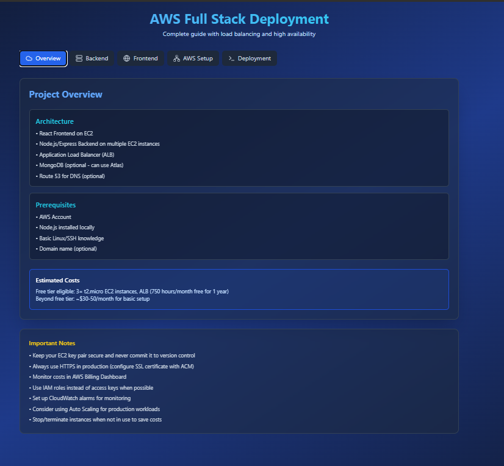
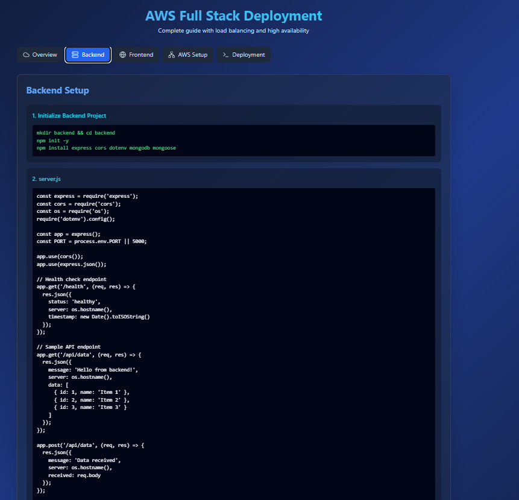
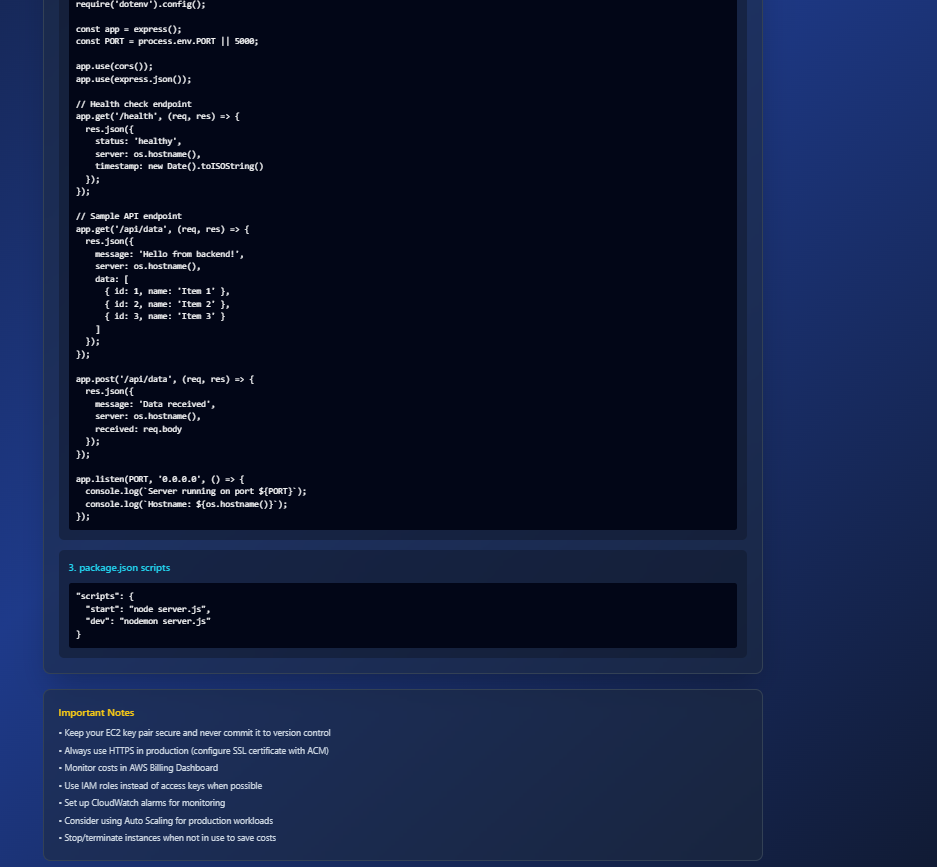
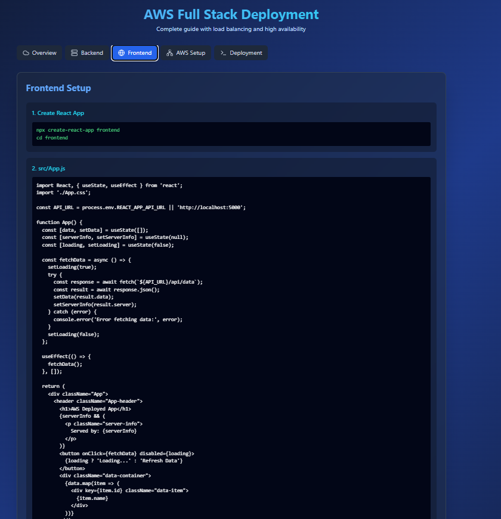
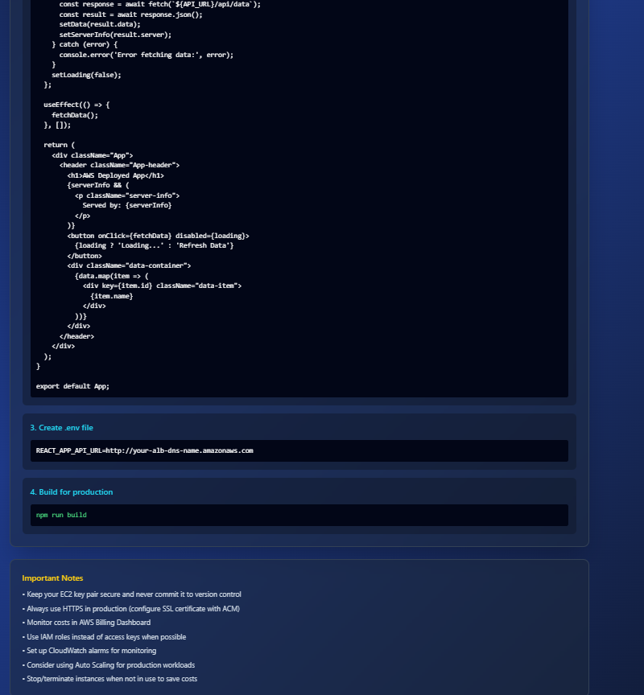
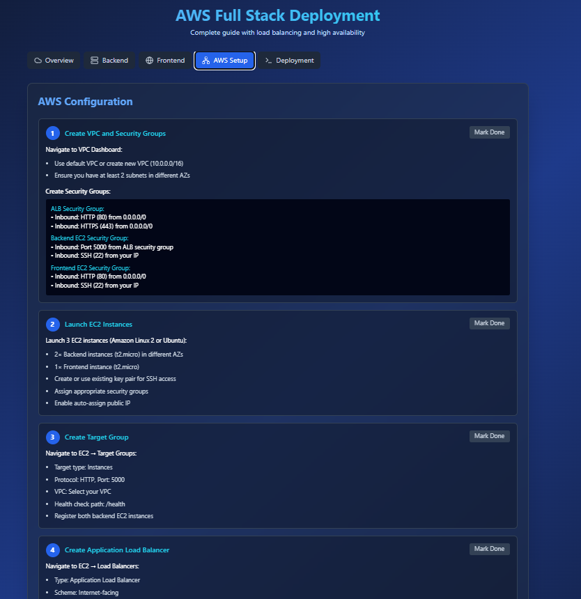
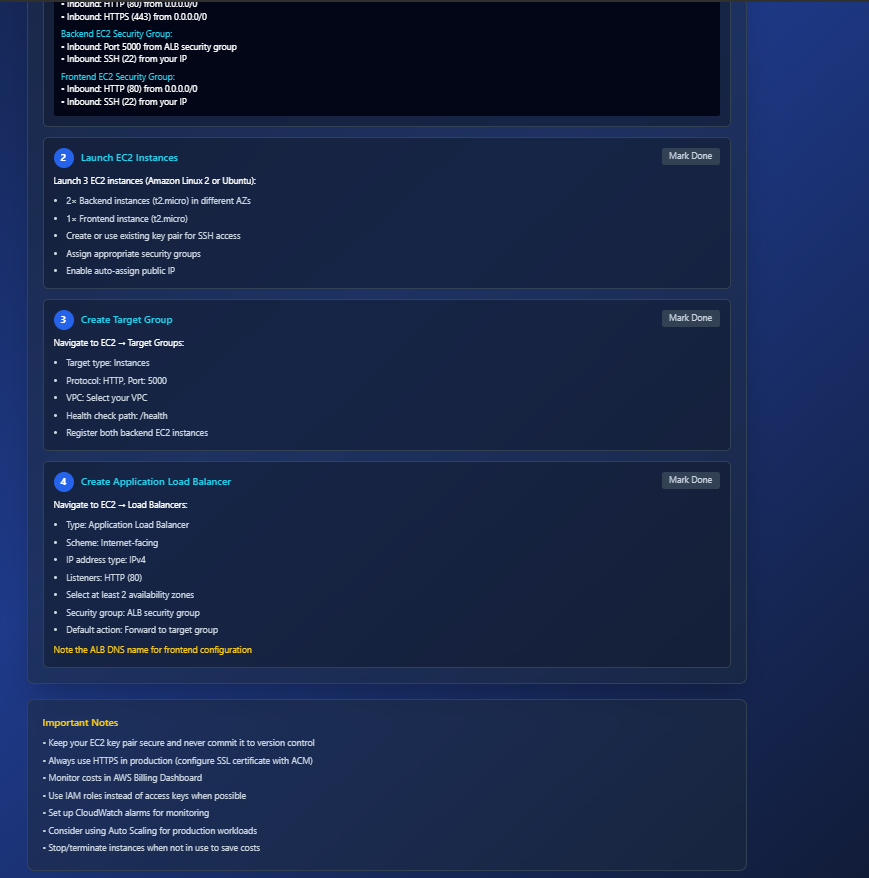
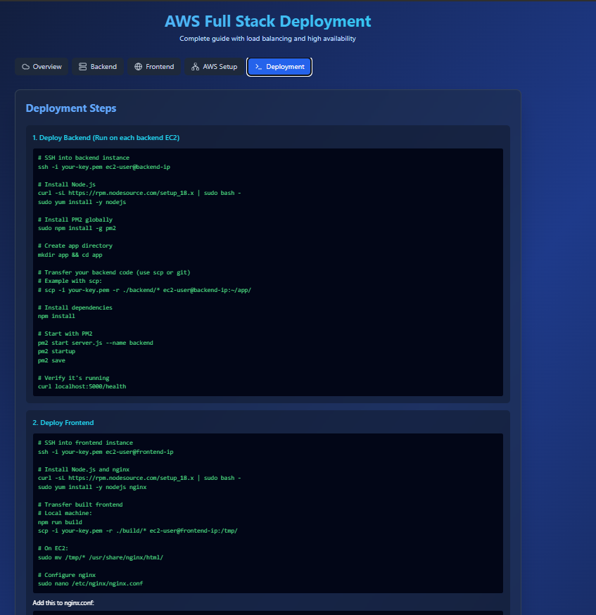
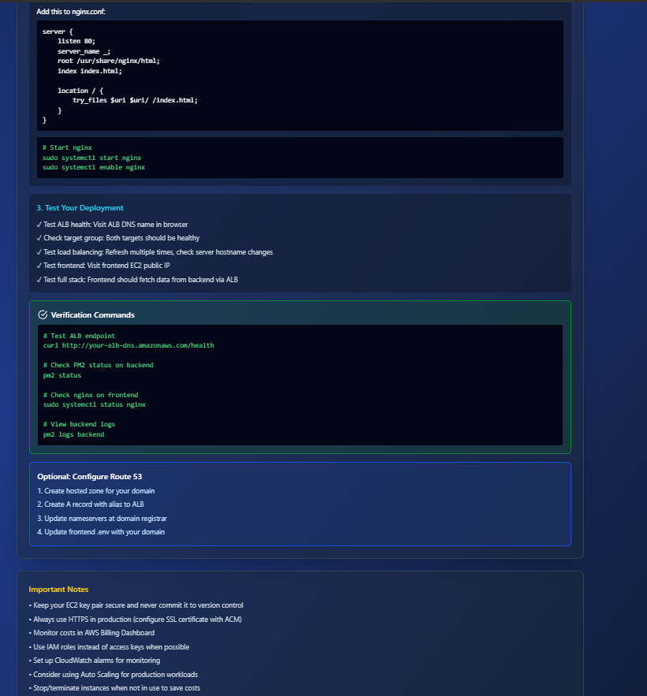

# AWS Full Stack Deployment with Load Balancing

A complete guide to deploying a React + Node.js application on AWS with Application Load Balancer for high availability and scalability.

## 📸 Project Output Screenshots

Below are all the output images showing successful deployment and execution of the project:

